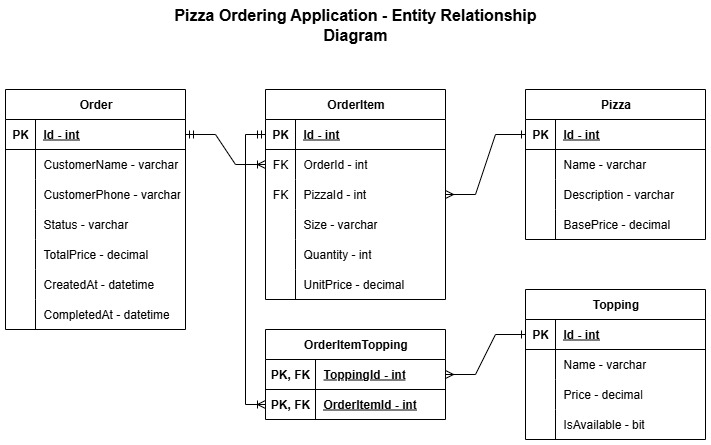

# Pizza Ordering Application

A RESTful API for pizza ordering built with .NET 9, following Clean Architecture principles and using the MediatR pattern for CQRS implementation.

## 🏗️ Architecture

This application follows **Clean Architecture** principles with the following layers:

- **Domain**: Core business entities and logic
- **Application**: Use cases, DTOs, and business rules
- **Infrastructure**: Data access, external services
- **API**: Controllers and HTTP endpoints

### Entity Relationship Diagram



*Entity Relationship Diagram showing the database structure with Order, OrderItem, Pizza, Topping, and OrderItemTopping tables and their relationships.*

## 🚀 Getting Started

### Prerequisites

- .NET 9 SDK
- Visual Studio 2022 or VS Code
- SQLite (included with EF Core)

### Installation

1. **Clone the repository**
   
   ```bash
   git clone https://github.com/vladatman/PizzaOrderingApplication.git
   cd PizzaOrderingApplication
   ```

2. **Restore dependencies**
   
   ```bash
   dotnet restore
   ```

3. **Run database migrations**
   
   ```bash
   cd PizzaOrdering.API
   dotnet ef database update
   ```

4. **Start the application**
   
   ```bash
   dotnet run
   ```

The API will be available at `https://localhost:7001` (or the port shown in the console).

## 📋 Features

### ✅ Implemented Features

- **Pizza Management**
  
  - List all pizzas with filtering by max price
  - Get pizza details with default toppings
  - Filter pizzas by specific toppings

- **Topping Management**
  
  - List all available toppings
  - Get topping details
  - Track topping availability

- **Order Management**
  
  - Create new orders with multiple items
  - View order details and history
  - Update order status
  - Search orders by customer name

- **Pricing System**
  
  - Size-based pricing multipliers
  - Default toppings included in base price
  - Extra toppings add to total cost
  - Automatic price calculations

## 🔌 API Endpoints

### Pizzas

| Method | Endpoint                         | Description                                              |
| ------ | -------------------------------- | -------------------------------------------------------- |
| GET    | `/api/pizzas`                    | Get all pizzas (filter by `maxPrice`)                    |
| GET    | `/api/pizzas/{id}`               | Get pizza by ID                                          |
| GET    | `/api/pizzas/with-toppings`      | Get pizzas with default toppings (filter by `toppingId`) |
| GET    | `/api/pizzas/{id}/with-toppings` | Get pizza with default toppings by ID                    |

### Toppings

| Method | Endpoint             | Description       |
| ------ | -------------------- | ----------------- |
| GET    | `/api/toppings`      | Get all toppings  |
| GET    | `/api/toppings/{id}` | Get topping by ID |

### Orders

| Method | Endpoint                                 | Description                 |
| ------ | ---------------------------------------- | --------------------------- |
| GET    | `/api/orders`                            | Get all orders              |
| GET    | `/api/orders/{id}`                       | Get order by ID             |
| GET    | `/api/orders/by-customer/{customerName}` | Get orders by customer name |
| POST   | `/api/orders`                            | Create new order            |
| PUT    | `/api/orders/{id}/status`                | Update order status         |

## 📝 Request/Response Examples

### Create Order

**Request:**

```json
POST /api/orders
{
  "customerName": "John Doe",
  "customerPhone": "+1234567890",
  "items": [
    {
      "pizzaId": 1,
      "size": "Large",
      "quantity": 2,
      "extraToppingIds": [3, 5]
    }
  ]
}
```

**Response:**

```json
{
  "id": 1,
  "customerName": "John Doe",
  "customerPhone": "+1234567890",
  "status": "Pending",
  "totalPrice": 28.50,
  "createdAt": "2024-01-15T10:30:00Z",
  "items": [
    {
      "id": 1,
      "pizzaName": "Margherita",
      "size": "Large",
      "quantity": 2,
      "unitPrice": 14.25,
      "extraToppings": [
        { "id": 3, "name": "Mushrooms", "price": 1.50 },
        { "id": 5, "name": "Olives", "price": 1.00 }
      ]
    }
  ]
}
```

## 🗄️ Database Schema

The application uses **SQLite** with the following key entities:

- **Order**: Customer information, status, pricing, timestamps
- **OrderItem**: Individual pizza items within orders
- **Pizza**: Available pizzas with base pricing
- **Topping**: Available toppings with individual pricing
- **OrderItemTopping**: Junction table for extra toppings

### Sample Data

The database is seeded with:

- **3 Pizzas**: Margherita, Pepperoni, Hawaiian
- **6 Toppings**: Mushrooms, Olives, Peppers, Sausage, Bacon, Pineapple
- **Size Multipliers**: Small (1.0x), Medium (1.45x), Large (1.89x)

## 🏛️ Technical Decisions

### Architecture Patterns

- **Clean Architecture**: Separation of concerns across layers
- **CQRS with MediatR**: Commands for writes, Queries for reads
- **Repository Pattern**: Data access abstraction

### Key Technologies

- **.NET 9**: Latest framework version
- **Entity Framework Core**: ORM with Code-First approach
- **SQLite**: Lightweight, file-based database
- **MediatR**: Mediator pattern implementation
- **AutoMapper**: Object-to-object mapping

### JSON Configuration

- **Null values ignored**: Clean API responses
- **Enums as strings**: Readable status values
- **Proper HTTP status codes**: RESTful error handling

## 📁 Project Structure

```
PizzaOrderingApplication/
├── PizzaOrdering.API/           # Web API layer
│   ├── Controllers/             # HTTP endpoints
│   ├── Program.cs              # Application startup
│   └── appsettings.json        # Configuration
├── PizzaOrdering.Application/   # Business logic layer
│   ├── Commands/               # Write operations
│   ├── Queries/                # Read operations
│   ├── Handlers/               # Command/Query handlers
│   ├── DTOs/                   # Data transfer objects
│   └── Interfaces/             # Service contracts
├── PizzaOrdering.Domain/        # Core business entities
│   ├── Entities/               # Domain models
│   ├── Enums/                  # Business enums
│   └── Constants/              # Business constants
└── PizzaOrdering.Infrastructure/ # Data access layer
    ├── Data/                   # DbContext and seeding
    ├── Repositories/           # Data access implementations
    ├── Services/               # Business service implementations
    └── Migrations/             # EF Core migrations
```

---

**Built with ❤️ using .NET 9 and Clean Architecture principles**


